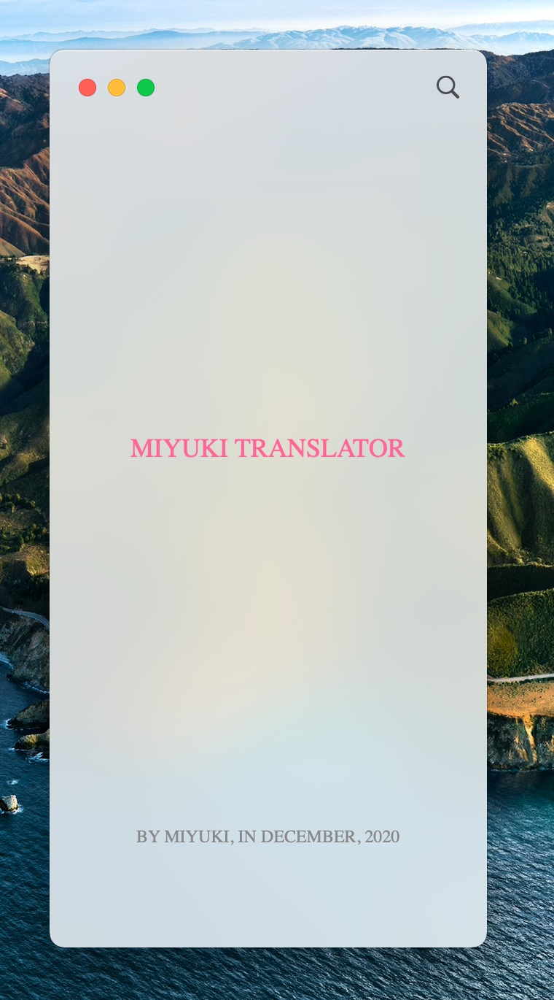

# Miyuki Translator (MacOS Version)

    

## Introduction

An application than can translate texts from clipboard.

* When reading paper, just copy the word or sentenses you want to translate, the translate result will show,
* 妈妈再也不用担心我看不懂论文啦 (Mom no longer has to worry that I can't read the paper)

## System Requirements
* MacOS 11.0 Big Sur or above

## Screenshots

____
by Miyuki, December 2020